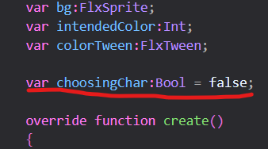

# Psych Engine Instructions

-   Step 1: Ensure that you have made the background folder a library path in the Project.xml file. If you don't know how, go [here](../../../Main%20Assets%20Needed/).
-   Step 2: Download the Psych Engine CharMenu [here](../../../CharMenuFiles/CharMenu-Psych.hx).
-   Step 3: Ensure that the location of the newly installed Psych CharMenu is in the source folder.

    

-   Step 4: Ensure that the background folder is located in the assets folder.

    

-   Step 5: Add any characters you want in their specific variables.

    

-   Step 6: Move into whatever state you need, such as Freeplay (which I will be using for this example).
-   Step 7: Add a boolean variable into said state underneath a name you will recognize, I used choosingChar, and set it to false (for now).

    

-   Step 8: Find where the state changes into a new one and add a else if statement to check if the Variable you created earlier is true so you can go into the CharMenu state.

    

-   Step 9: Build the engine, see if the engine at least runs, then close the application, set the variable you created earlier to true, then rebuild the application, run it, and see if the character menu appears.
-   Step 10: Done! For additional/extra instructions for special things, go to the [Extra](../Extra/) folder.
